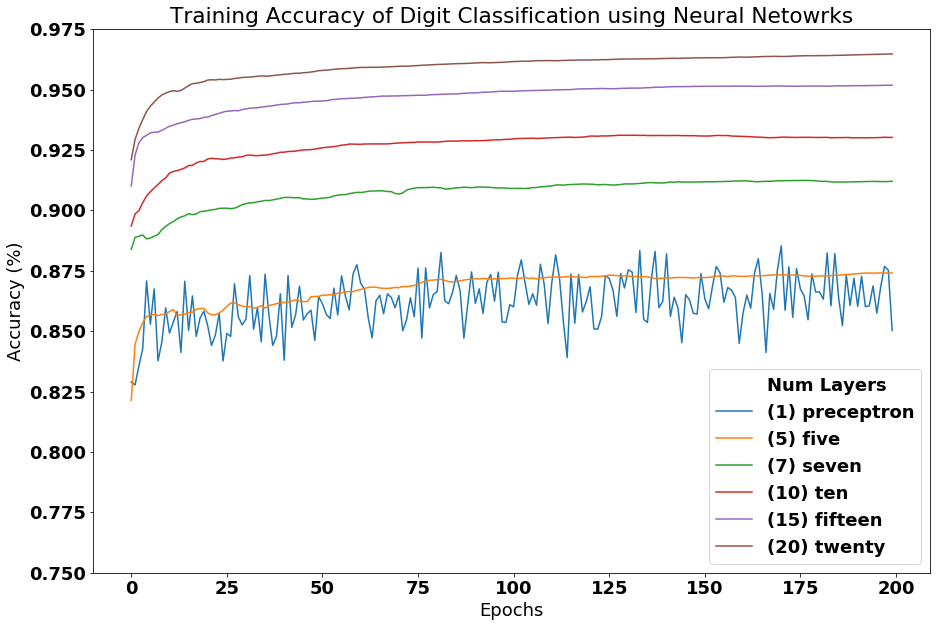
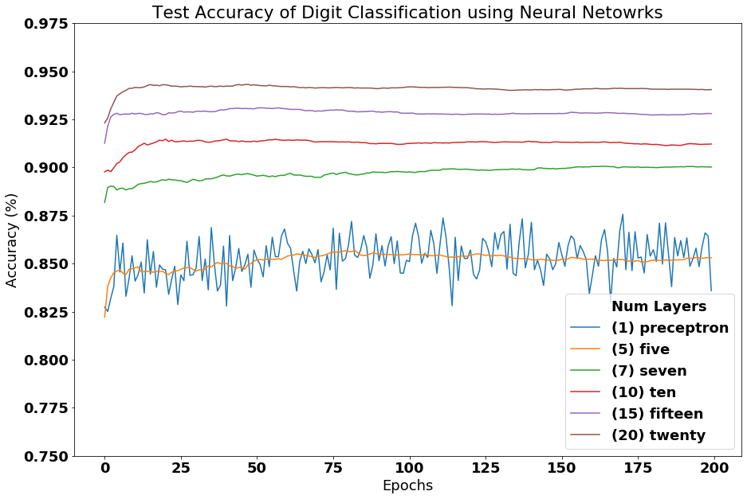
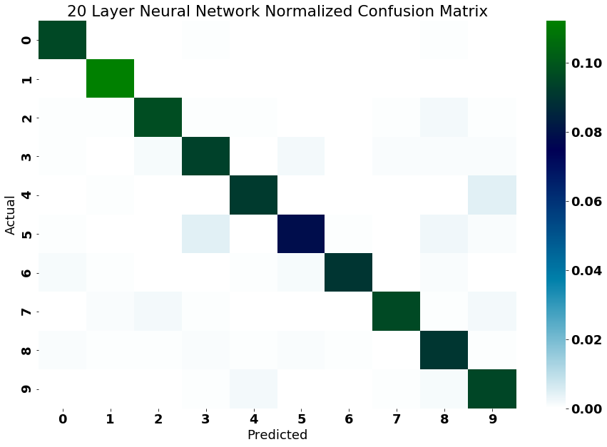

# neural-network-mnist
Neural Network classification of the MNIST dataset using single and multilayer perceptrons (MLP).
The MLP uses the sigmoid activation function for all layers.
MNIST data can be downloaded from Kaggle (https://www.kaggle.com/oddrationale/mnist-in-csv)
## How to run
Unzip mnist.zip

For running the single layer perceptron classifier with a learning rate of 0.1 and 50 epochs
python single_layer_perceptron.py mnist_train.csv mnist_test.csv 0.1 50

For running the neural network classifier with a learning rate of 0.1 and 50 epochs
python neural_network.py mnist_train.csv mnist_test.csv 0.1 50

### Perceptron performance
It achieves an 83% out of sample accuracy after 1 epoch, and 86% accuracy after 10 epochs.

### Neural network performance
It achieves a 91% out of sample accuracy after 1 epoch, and 93% accuracy after 10 epochs with 20 hidden layers.

###Training and Test Accuracy for multiple hidden units

###Test and Test Accuracy for multiple hidden units

###Confusion Matrix for 20 hidden layers

